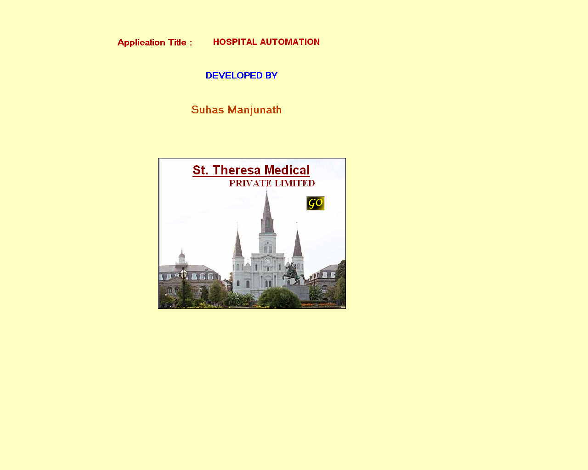



## Medical Automation

### Description

to demonstrate how the coding of Hospital Billing System works :)
 
### More Info
 

             |
---                |---
**Submitted On**   |2008-04-19 10:48:22
**By**             |[Suhas Manjunath Kashyap](https://github.com/Planet-Source-Code/PSCIndex/blob/master/ByAuthor/suhas-manjunath-kashyap.md)
**Level**          |Beginner
**User Rating**    |5.0 (25 globes from 5 users)
**Compatibility**  |VB 6\.0, VBA MS Access
**Category**       |[Complete Applications](https://github.com/Planet-Source-Code/PSCIndex/blob/master/ByCategory/complete-applications__1-27.md)
**World**          |[Visual Basic](https://github.com/Planet-Source-Code/PSCIndex/blob/master/ByWorld/visual-basic.md)
**Archive File**   |[Medical\_Au2110094192008\.zip](https://github.com/Planet-Source-Code/suhas-manjunath-kashyap-medical-automation__1-70435/archive/master.zip)

